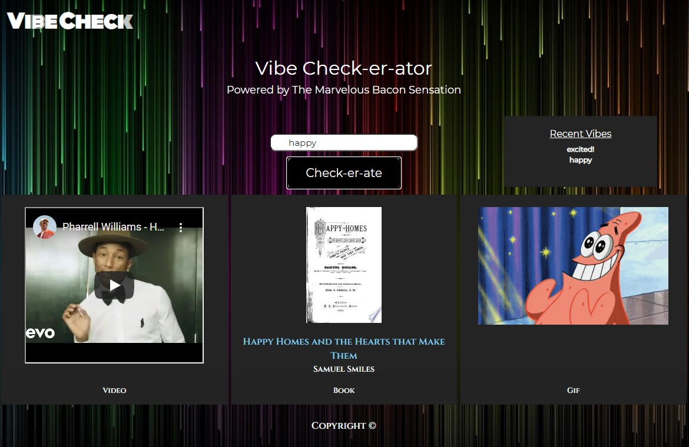
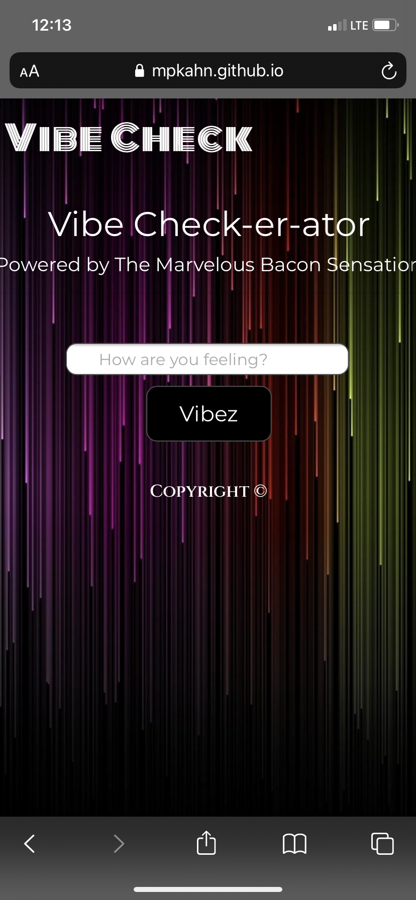

# Vibe Check-er-ator
## Marvelous Bacon Sensation

## Description
Have you ever just been feeling a mood and wanting to sink further down into it? The Vibe-Check-er-ator is a simple web app that will allow you to enter your current mood (aka vibe) and then receive some media suggestions to keep riding the wave of your current vibe. 

## Installation
Clone this repository and open html, js, and css files in code editor. View website at https://mpkahn.github.io/thevibe/. Images in assets folder.

## Usage
Open https://mpkahn.github.io/thevibe/ and view the vibe bar in the center. Enter your current mood/vibe and hit the "Vibez" button. 

From there you will see three pieces of media generate! A youtube link with a video related to your vibe, a book suggestion that will link you to google books if you click on the title, and a gif that relates to your current mood. 

If you have had enough of your curren vibes, you can enter another word into the vibe bar and hit "vibez" to generate new content. All your previous vibe queries are stored in local storage and listed on the page. Your vibe searches should show a variety of content, even if your mood is the same!

## Credits

Much help on jquery usage referenced at https://api.jquery.com/click/
Google dev APIs (both youtube & google books) https://console.cloud.google.com/apis
Giphy APIs https://developers.giphy.com/
Google fonts for our fonts + logo https://fonts.google.com/
Bootstrap https://getbootstrap.com/docs/5.0/getting-started/introduction/

## License
MIT License

Copyright (c) [2021] [Marvelous Bacon Sensation]

Permission is hereby granted, free of charge, to any person obtaining a copy of this software and associated documentation files (the "Software"), to deal in the Software without restriction, including without limitation the rights to use, copy, modify, merge, publish, distribute, sublicense, and/or sell copies of the Software, and to permit persons to whom the Software is furnished to do so, subject to the following conditions:

The above copyright notice and this permission notice shall be included in all copies or substantial portions of the Software.

THE SOFTWARE IS PROVIDED "AS IS", WITHOUT WARRANTY OF ANY KIND, EXPRESS OR IMPLIED, INCLUDING BUT NOT LIMITED TO THE WARRANTIES OF MERCHANTABILITY, FITNESS FOR A PARTICULAR PURPOSE AND NONINFRINGEMENT. IN NO EVENT SHALL THE AUTHORS OR COPYRIGHT HOLDERS BE LIABLE FOR ANY CLAIM, DAMAGES OR OTHER LIABILITY, WHETHER IN AN ACTION OF CONTRACT, TORT OR OTHERWISE, ARISING FROM, OUT OF OR IN CONNECTION WITH THE SOFTWARE OR THE USE OR OTHER DEALINGS IN THE SOFTWARE.
